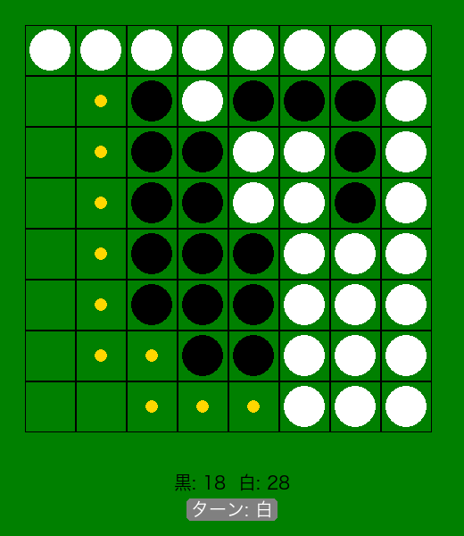

# オセロゲーム (Othello Game)

Pygameを使用したシンプルなオセロ（リバーシ）ゲームの実装です。



## 必要環境

- Python 3.8+
- Pygame 2.0+

## インストール

```bash
pip install pygame
```

## 実行方法

```bash
python othello_game.py
```

## 操作方法

- マウスクリック: 金色のマーカーが表示されている場所に石を置く
- ウィンドウを閉じる: ゲーム終了

## プロジェクト構成

```
001Day_Othello/
├── othello_game.py    # メインゲームファイル
├── BasicSpec.md       # 基本仕様書
├── RequirementSpec.md # 要件定義書
└── README.md         # このファイル
```

## 技術仕様

### クラス構成
- `Board`: 盤面の状態管理
  - 8×8の2次元配列で石の配置を管理
  - 有効手の判定と石の反転処理
- `OthelloGame`: ゲーム全体の制御
  - Pygameによる描画処理
  - イベント処理とゲームループ

### 主要なメソッド
- `is_valid_move()`: 指定位置が有効な手かを判定
- `get_valid_moves()`: 現在のプレイヤーの全有効手を取得
- `make_move()`: 石を配置し、挟まれた石を反転
- `switch_player()`: プレイヤー交代とパス/終了判定

## ライセンス

このプロジェクトは学習目的で作成されました。

---

**100日コーディングチャレンジ Day 001**